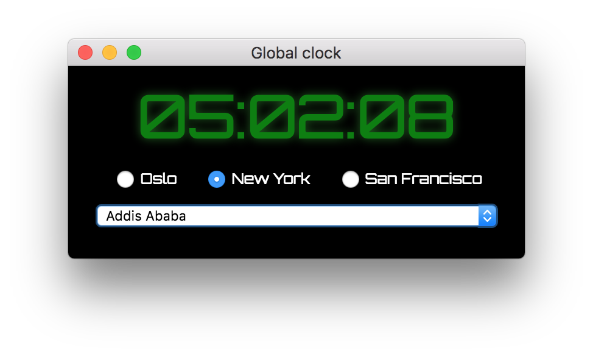

# Global Clock App

Description: An open-source and customizable global clock.

## Screenshot

## Background

I wanted a global clock for my desktop, instead of googling it all the time.

## Roadmap

In no particular order.

1. Skins
2. Larger list of cities (Get and format tsz timezone data)
3. Style frame
4. Smoother clock countdown
5. Force to be always on top (is this possible with Electron)
6. CircleCi integration